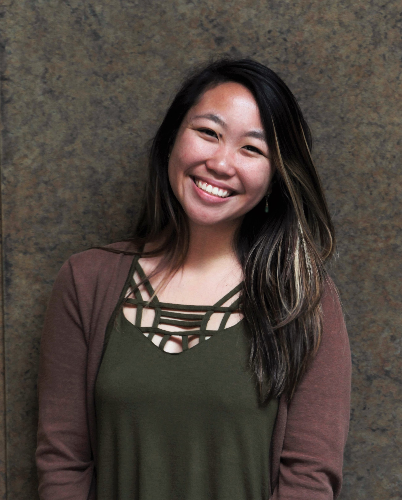

# Quarter Quartet

## Project Synopsis
We decided to build an Android scavenger hunt specifically for stanford dorms to be used by dorm staff and students. Many dorms tend to host scavenger hunts for students but often struggle with the logistics of such event. This app would assist in the creation and managment of scavenger hunts!

## Team Members

Member | Photograph
--- | ---
Paulina Reyes | 
Richard Verdin | 
Maribel Cardiel | 
Jorge Avelar-Lopez | 

## Team Skills Matrix
Member | Skills | Personal Traits | Desired Growth | Weaknesses
--- | --- | --- | --- | ---
Paulina | Game dev, Android app dev, UI design & prototyping, Web dev, API design & dev | Dependent on time schedules/personally set deadlines, Appreciates organized & focused meetings, Open communicator | Better design/front-end skills, Using APIs for more advanced use cases | Database manipulation, sending too many messages to a group chat at once
Richard | Web Dev, Android Programming, Game Design, Marketing + Storytelling, Project Management, Figma prototyping | Planning ahead, thinking big picture, clean + cohesive design | Design skills | Low level systems
Maribel | Robotics, Electronics & Hardware, Github Version Control, Algorithms & Data Analysis, Web Development, Digital design | Meticulous, detail oriented, time-management | Better design skills, App Dev, Organization skills | Android App Development
Jorge | Graphics, Computer Vision, NLP, Android App Dev, Git Version Control, Game Dev (Unity) | Organized, Team oriented, Timely, Decisive | Web Dev, UI | Getting hung up on details

## Team Communication  
1. For the Teaching Team - Emails: preyeshi@, rverdin@, mcardiel@, avelar98@

2. For project work - [Github](https://github.com/orgs/StanfordCS194/teams/team-15/)

3. Between teammates - Facebook Messenger

## Documentation 
1. Process Documentation: https://docs.google.com/document/d/1WCWHc2JnRtfZ1WNa06kDQyUOZSid_MkYYANgi1FjsD8/edit?usp=sharing
2. Technical Documentation: https://docs.google.com/document/d/1rHstpipldx7fWDxYxHF8QUEPtvRfX6c9bU8GtV21EPY/edit?usp=sharing
3. Decision-making log: https://docs.google.com/document/d/1wFbg90TCWmBg7hKyoMpt9uz_aQvH-wZeH89_rNkYV4Q/edit?usp=sharing
